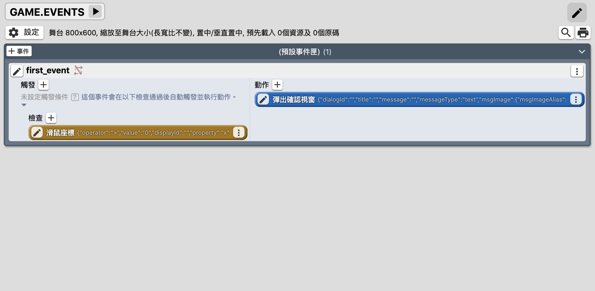
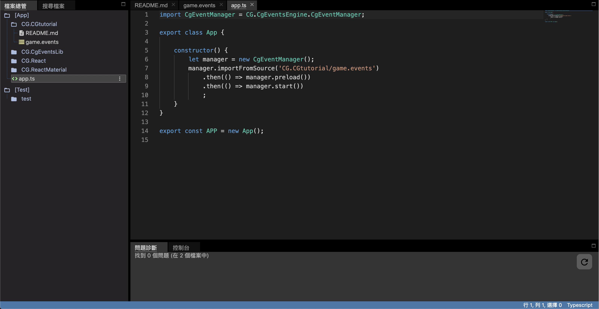
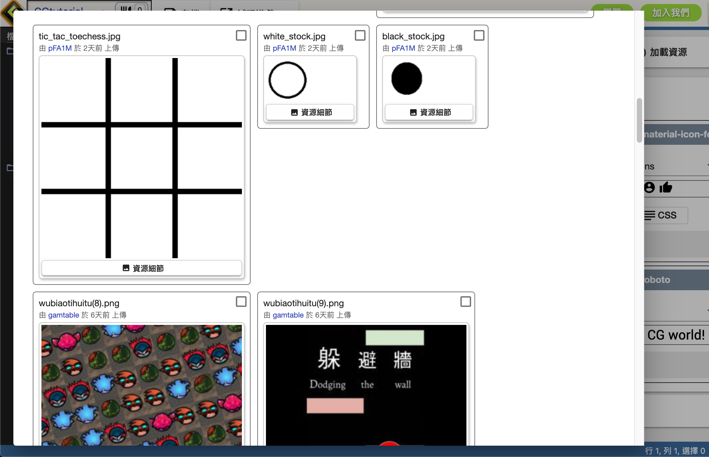
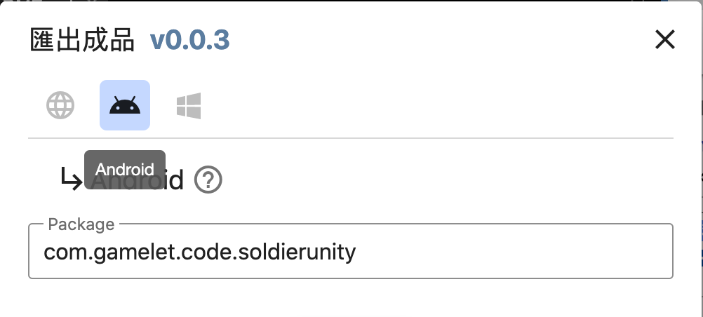
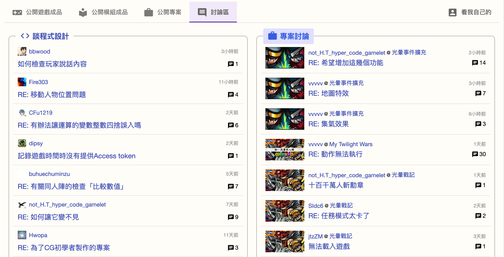

## 什麼是Code.Gamelet(C.G.)?

[C.G.](code.gamelet.com) 以遊戲自製並互相觀摩的方式，讓玩家以最自然的方式自學程式語言、融入程式設計的社群。

## 特色

### 不會用編程，也可以設計你的遊戲。

C.G.提供了全新的遊戲設計方法 - CG同人陣。

取代傳統編程，CG同人陣以按鍵來設計程式，用戶不需要記住任何代碼語法，也可以設計出精美的遊戲。

### 整合式線上開發，不需環境設定、不需安裝軟體。

C.G.提供線上整合式線上開發環境，你並不需要安裝任何軟體便可進行程式開發。編程器會提供偵錯及建議功能提升開發速度。

### 使用Typescript開發遊戲，比Javascript更強大。

C.G. 所有遊戲及成品均使用Typescript(TS)開發。TS是一種Javascript(JS)的擴充，支援變數型別，interface，enum等等JS沒有的功能。

Typescript官方網站（中文）：https://www.tslang.cn/

Typescript教學（中文）：https://willh.gitbook.io/typescript-tutorial/basics

Typescript 線上編譯器(英文): https://www.typescriptlang.org/play/

:::info
Typescript 線上編譯器提供方便快捷的方法，讓你測試你的程式碼。但是Typescript 線上編譯器只能編寫最基本的Typescript，並不能測試C.G.的模組。
:::

### 可分享共用圖片、音效等資源。

C.G. 提供資源庫，你可以在資源庫搜尋你想要的素材。

### 可匯出遊戲成品至Android等手機裝置及商店。

C.G. 的成品不只可以製成網頁遊戲，你也可以匯出成手機App，發佈到Play Store等商店。

### 設有程式設計討論區，可以隨時發問。

程式設計討論區讓你自由討論遊戲開發和各種問題，並交流遊戲開發心得。

